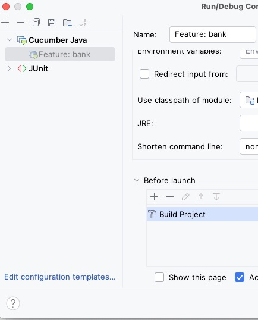

This project shows a setup of a Java project for Cucumber and Mockito. It works together with both JUnit 4 and JUnit 5 and JDK >= 21. 

All the tests should pass in your favourite IDE
and when running `mvn test`. If not, please contact me (huba@dtu.dk). 

You can use the existing tests as a starting point
for your own tests.

Remember not to do too much in a single step. Aim to progress from one functioning system to the next with small, incremental changes. Avoid leaving the system in a broken state for an extended period, as this makes identifying errors much harder. It’s crucial to know exactly what change caused a working project to fail. When in doubt, revert to the last working version and proceed again in smaller, manageable steps.

When you use this project as a starting point, please remember to rename the project in the pom.xml file (e.g. group-id and artefact-id) and remember to remove those feature files and classes that were just included for demonstration purposes. That is, make sure your code is cleaned up and all unnecessary code is removed.

## Eclipse
For using Cucumber in Eclipse, you want to install the Cucumber plugin. In Eclipse, installing the Cucumber plugin is offered to you once you try to open a file with extension .feature or go to the marketplace and search for Cucumber. 

Note that the Cucumber plugin needs to have the program ``behave`` installed in its path. ``behave`` is a Python program that helps check the Gherkin syntax of feature files. Note that this is not required to run the Cucumber tests. You can install ``behave`` using ``pip install behave``. After that you have to make sure that the directory in which ``behave`` is installed is in your path when you start Eclipse.

## IntelliJ
Important for IntelliJ, rebuild the project from the build menu after loading the example to ensure that IntelliJ finds the step definition classes. You can also edit the run configuration to make sure that the correct build function is called for the Cucumber Java configuration. That build function needs to be "build project" instead of just "build". One can also update the Cucumber Java build configuration template to replace "build" by "build project".

